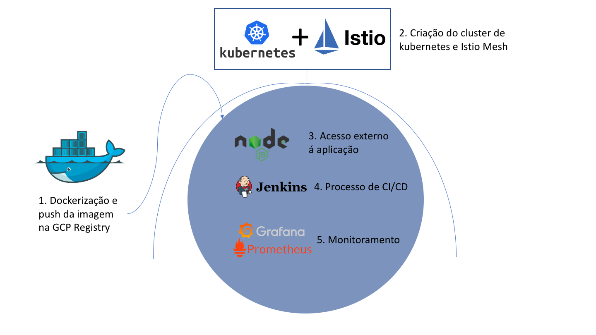

# Teste DevOps Mutant

Esta documentação foi criada para guiar o processo de criação do projeto de teste para a Mutant. Como descrito no enunciado do teste, o desafio consiste em 3 partes: 

- Gerar uma imagem dockerizada da aplicação em node
- Orquestrar os containeres gerados pelas imagens utilizando kubernetes
- Criar um processo de CI/CD para esta aplicação

Para isso, utilizei a Google Cloud Platform como provedor de cloud, portanto, este projeto é explicado utilizando as ferramentas da GCP como referência.

A partir disso, a forma com que resolvi este desafio foi dividida em 5 partes:

- Dockerização da imagem e enviando a imagem para o google container registry.
- Criação do cluster de kubernetes e instalação dos serviços do Istio.
- Acesso externo á aplicação.
- Criação dos processos de CI/CD utilizando o Jenkins.
- Moitoramento Utilizando o Prometheus e Grafana. 

Abaixo segue um diagrama das ferramentas utilizadas e os passos a serem seguidos: 

__Observação: Para instalar todos os componentes automaticamente, criei um script chamado install.sh.__

__Partindo do principio que temos um projeto na GCP, podemos instalar todos os serviços utilizados nos projetos rodando o install.sh, sobrando apenas algumas configurações manuais como configurar DNS e as credenciais necessarias para o jenkins fazer alterações no cluster.__

## 1. Transformando a aplicação em uma imagem Docker

Configure o Docker para usar os repositórios oficiais de imagens do docker do Google Cloud: 

    gcloud auth configure-docker

Dentro da pasta raiz deste repositório, temos um Dockerfile que será o Dockerfile utilizado para criar a imagem. Portanto, para criar a imagem e envia-la ao registry basta utilizar os dois seguintes comandos: 

    docker build -t gcr.io/$PROJECT_ID/$image_name:latest
    docker push gcr.io/$PROJECT_ID/$image_name:latest

## 2. Criação do cluster de kubernetes e instalando o Istio Service Mesh

Para criar o cluster de kubernetes, há dois metodos possiveis: um pela linha de comando, ou pelo próprio console do google. Pela linha de comando seria: 

    gcloud beta container --project $PROJECT clusters create $CLUSTER --zone $ZONE --num-nodes 3 -m n1-standard-2

Para conectar no cluster: 

    gcloud container clusters get-credentials $CLUSTER --zone $ZONE --project $PROJECT

Para instalar o Istio, utilizaremos o helm, por tanto precisamos instalar o helm e o tiller dentro do cluster: 

    curl https://raw.githubusercontent.com/kubernetes/helm/master/scripts/get | bash

    helm init

    kubectl create serviceaccount --namespace kube-system tiller

    kubectl create clusterrolebinding tiller-cluster-rule --clusterrole=cluster-admin --serviceaccount=kube-system:tiller

    kubectl patch deploy --namespace kube-system tiller-deploy --patch '{"spec": {"template": {"spec": {"serviceAccount": "tiller"} } } }'

Agora precisamos instalar o Istio: 

    curl -L https://git.io/getLatestIstio | ISTIO_VERSION=1.5.0 sh -

    helm repo add istio.io https://storage.googleapis.com/istio-release/releases/1.5.0/charts/

    helm repo update

    kubectl create namespace istio-system

    cd istio-1.5.0

    kubectl apply -f install/kubernetes/helm/helm-service-account.yaml

    helm init --service-account tillers

    helm install install/kubernetes/helm/istio-init --name istio-init --namespace istio-system

    kubectl -n istio-system wait --for=condition=complete job --all

    helm install install/kubernetes/helm/istio --name istio --namespace istio-system

Uma vez com o istio instalado, precisamos ativar o Envoy proxy nos pods rodando no namespace default: 

    kubectl label namespace default istio-injection=enabled

## 3. Acesso externo a aplicação

Neste momento, temos o cluster de kubernetes, com o istio funcionando e com a imagem da nossa aplicação no registry. Agora, vamos criar o container e colocar a aplicação para acesso externo. Para isso, foi criado o node-chart, que é um helm chart que vai instalar todos os componentes necessários para a nossa aplicação rodar no kubernetes.

(Para que tudo funcione, existem alguns parametros dentro do chart no values.yaml que devem ser editados de forma personalizada. Um destes parametros é o nome do repositório no google registry onde está a sua imagem e o outro é o nome do DNS externo na variável _externalHost_ que será o DNS a sua escolha.)

    cd ..
    cd CI/node-helm
    helm install node-chart node-chart

Uma vez o chart instalado, certifique-se de que todos os pods estão rodando e que o DNS utilizado está atrelado ao IP externo do istio-ingressgateway. Este IP pode ser encontrado usando o seguinte comando: 

    kubectl get svc istio-ingressgateway --namespace istio-system

## 4. Criação dos processos de CI/CD utilizando o Jenkins

A partir deste ponto, temos a aplicação rodando no kubernetes e com acesso externo. Agora, podemos automatizar o processo de CI/CD utilizando o jenkins. 

Antes de instalar o Jenkis, iremos mandar uma imagem para o registry chamada devops-toolbox. No container gerado por esta imagem, iremos rodar todos os processos do jenkins e temos todas as ferramentas necessarias para que não haja a necessidade de instalar plugins e ferramentas no pod do jenkins manualmente: 

    cd devops_toolbox_base_image

    docker biuld -t gcr.io/$PROJECT/devops-toolbox:latest

Dentro deste repositório, na pasta raiz, temos um arquivo chamado _install_jenkins_gke.sh_. Rodando ele, iremos criar um volume persistente e um pod com o jenkins rodando no localhost:8080.

Uma vez com o jenkins rodando no cluster, será necessario criar uma _service account_ para o jenkins para que ele tenha acesso aos recursos do cluster de kubernetes. Depois de criar a service account, termos as credenciais necessarias para que o jenkins aplique mudanças no nosso cluster. 

## 5. Moitoramento Utilizando o Prometheus e Grafana

Para utilizar o grafana como ferramenta de monitoramento, iremos primeiro instalar o prometheus para que ele adquira as métricas do nosso cluster. 

    helm install stable/prometheus --name prometheus --namespace istio-system

    helm install stable/grafana --name grafana --namespace istio-system

Por fim teremos o grafana instalado e rodando no localhost:3000. Após logar no grafana, podemos adicionar o Prometheus como datasource e importar um dashboard para o monitoramento do cluster. 

__observação:Algumas versões do istio instalam automaticamente o prometheus e o grafana, tornando desnecessario este passo__